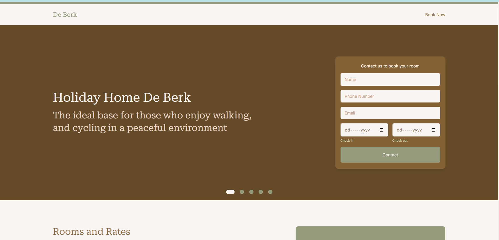

# De Berk

Source skeleton code for an internal Wypoon Website built with [Vue 3](https://vuejs.org/) and [Vite](https://vitejs.dev/).



## Requirements

- [Node](https://nodejs.org/en) v20.10.0 and later versions
- [NPM](https://www.npmjs.com/) 10.8.2 and later versions

## Scripts

```sh
npm install       # install dependencies
npm run dev       # run development server
npm run build     # compile for production server
npm run preview   # run production server (after build)

# dev scripts
npm run lint      # run linter
npm run format    # run prettier
```
